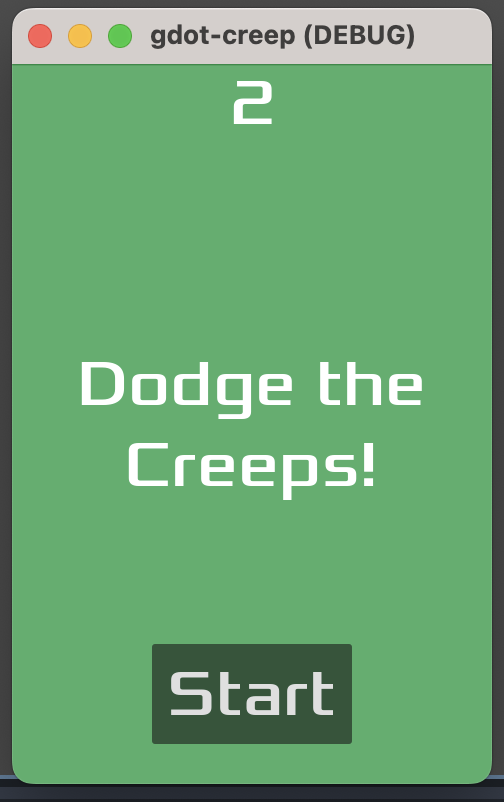

# Dodge the Creeps 2D assets

Used by the "Your first 2D game" tutorial:

https://docs.godotengine.org/en/latest/getting_started/first_2d_game/index.html

Example of my beautiful project! xD

### Start Screen

### Game Play

### Android
- https://docs.godotengine.org/en/stable/tutorials/export/exporting_for_android.html
- Pay closer attention to the versions listed for the sdk pkgs 
- Open GoDot via this terminal command: (I wonder if it gives admin privoleges?)
  - open /Applications/Godot.app
  - Suggestions from here: https://www.reddit.com/r/godot/comments/1204d2u/apksigner_failed_to_execute_warning_when/ 

Java SDk Path
- /Users/melissacrawford/Documents/GoDot_reqs/jdk-17.0.13+11/Contents/Home/

Android SDK Path
- /Users/melissacrawford/Library/Android/sdk/
